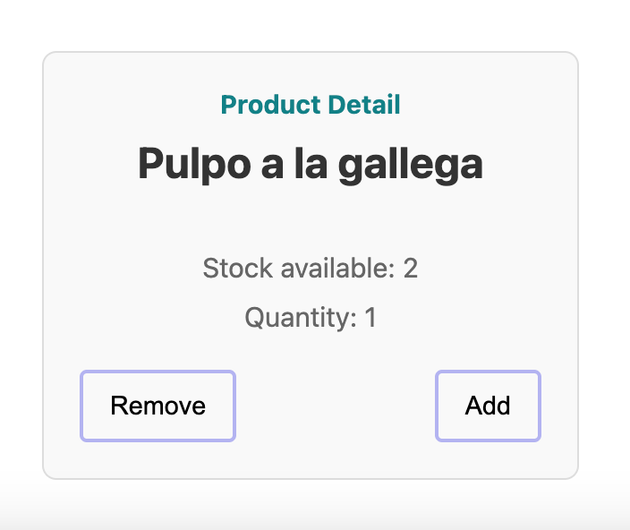

# KATA: UTILIZA LAS QUERIES APROPIADAS DE TESTING LIBRARY Y LOS MATCHERS DE JEST-DOM

## INTRODUCCIÓN

Este ejercicio es para practicar las queries de Testing Library y los matchers de @testing-library/jest-dom. Acabamos de
hablar del orden
recomendado para usar las queries de Testing Library basados en la accesibilidad.

El ejercicio consiste en corregir la suite de test de `ProductCard` basado en la explicación que acabamos de dar.

### PASOS A SEGUIR:

1. Describe los tests usando Gherkin.
2. Organiza cada test siguiendo la estructura AAA (Arrange, Act, Assert).
3. Refactoriza los matchers y queries de los tests para que sigan las recomendaciones.
4. No te olvides de la accesibilidad.
4. Recuerda, no testeamos detalles de implementación y testeamos desde la perspectiva del usuario.

** Si te da tiempo, añade un test más comprobando que `Sold Out` no se muestre cuando el producto tiene stock
disponible.

## Información sobre el componente Product Card

Recibe por props:

- La cantidad inicial para mostrar en `quantity`.
- El stock disponible de ese producto.
- El nombre del producto.

Cuando la cantidad es igual al stock disponible, se muestra un mensaje de `Sold Out`.
Los botones de `Remove` y `Add` se deshabilitan:

- **Remove**: cuando la cantidad es igual a 0.
- **Add**: cuando el stock es igual a 0.

#### Archivo a editar en la kata 👇:

- [Product Card Test](../../../src/katas/kata-1/ProductCard.test.tsx)

