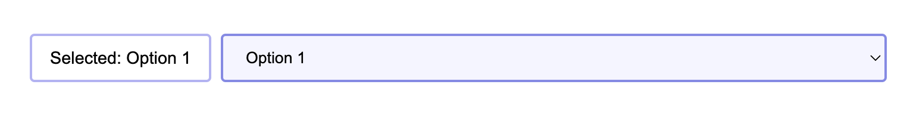

# KATA: DIFERENCIAS ENTRE userEvent VS fireEvent

## INTRODUCCIÓN

Este ejercicio es para ver de forma práctica algunas de las diferencias entre `userEvent` y `fireEvent` y cómo afecta a
la forma de testear.

El ejercicio consiste en refactorizar el test del componente `DropDown` que usa `fireEvent` por `userEvent`.

### PASOS A SEGUIR:

1. Ejectua el test. ¿Te da seguridad el test actual? El botón `Select an option` muestra
   un `console.log("Focus dispatch")` cuando se hace
   click en él. ¿Lo ves en el test?
2. Tu misión es refactorizar el test para testearlo simulando la forma más real a cómo lo haría un usuario
   con `userEvent`.
   Usando userEvent, ¿Ves el `console.log("Focus dispatch")`?

## Información sobre el componente DropDown

El componente `DropDown` contiene un botón que, al hacer click, muestra un menú desplegable con opciones.
El desplegable no está presente siempre en el DOM, solo cuando el usuario hace click en el botón para seleccionar una
opción. Y se cierra, cuando el usuario escoge una opción.

#### Archivo a editar en la kata 👇:

- [DropDown test](../../../src/katas/kata-3/DropDown.test.tsx)

#### 🔎 Pista:

[Utility APIs de userEvent](https://testing-library.com/docs/user-event/utility#-selectoptions-deselectoptions)
